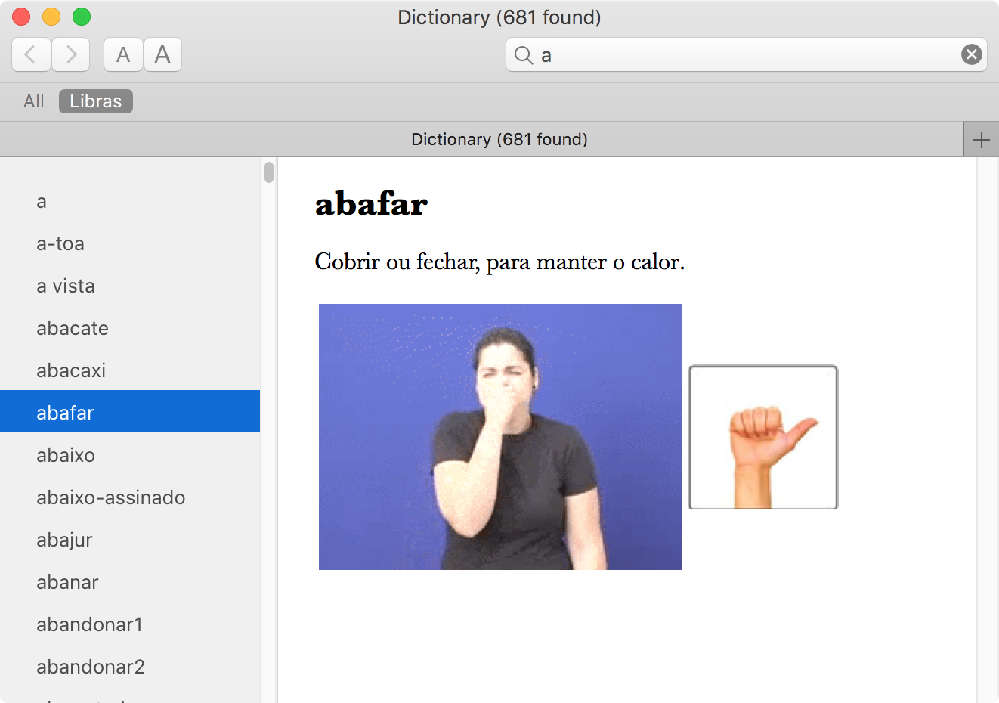

Dicionário de Libras para Mac
=================



Instalação
---
1. [Baixe o arquivo .zip do dicionário](https://github.com/thiagofelix/DicionarioLibras/releases/download/v1.0/Libras.dictionary.zip)
2. Extraia o arquivo .dictionary de dentro do arquivo .zip
3. Copie o arquivo .dictionary para a pasta de dicionários do seu Mac.
4. Habilite o dicionário "Libras" no menu de preferências do aplicativo de dicionário.
5. Divirta-se

Para mais informações veja este vídeo no Youtube para aprender instalar um dicionário novo no seu computador
https://youtu.be/PCm_AVa-XTg

Desenvolvimento
---

**Dependencies**
* json2xml-cli

**Build rápido**
```
curl -k -L https://github.com/thiagofelix/DicionarioLibras/raw/master/go.sh | sh
```

**Build passo a passo**
```
git clone https://github.com/thiagofelix/DicionarioLibras.git
cd DicionarioLibras
make install
```


Divirta-se

