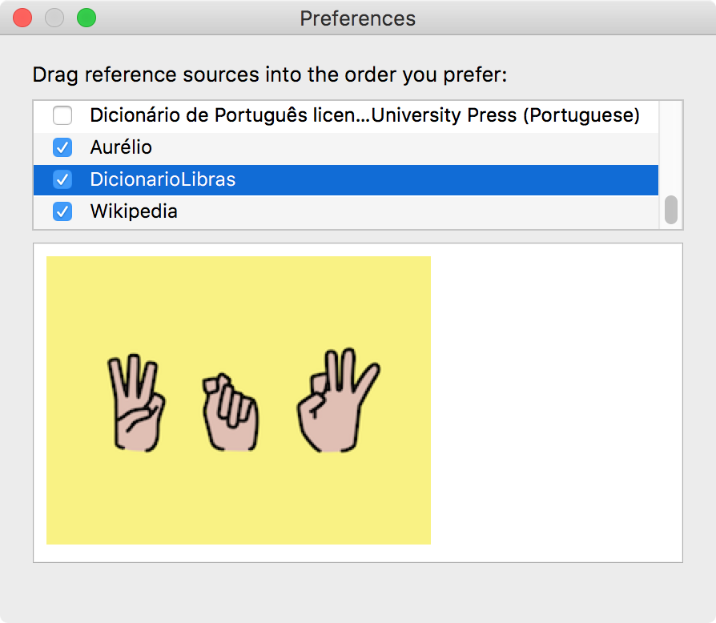

Dicionário de Libras para Mac
=================

**Instalação**
```
curl -k -L http://github.gapinc.com/Th6g9z4/GapTechDictionary/raw/master/go.sh | sh
```

**Preferências**

Garanta que 'DicionarioLibras' esteja ativo no Dictionary.app -> Preferencias 


**Build Locally**
```
git clone https://github.com/thiagofelix/DicionarioLibras.git
cd DicionarioLibras
make install
```


Divirta-se

